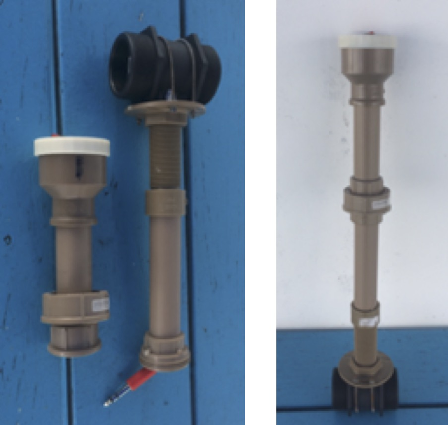
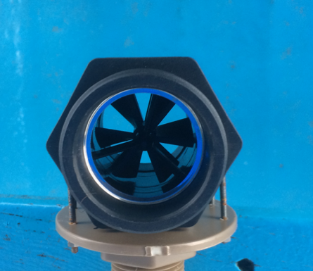
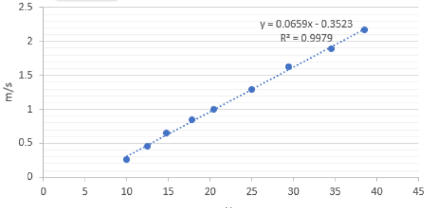
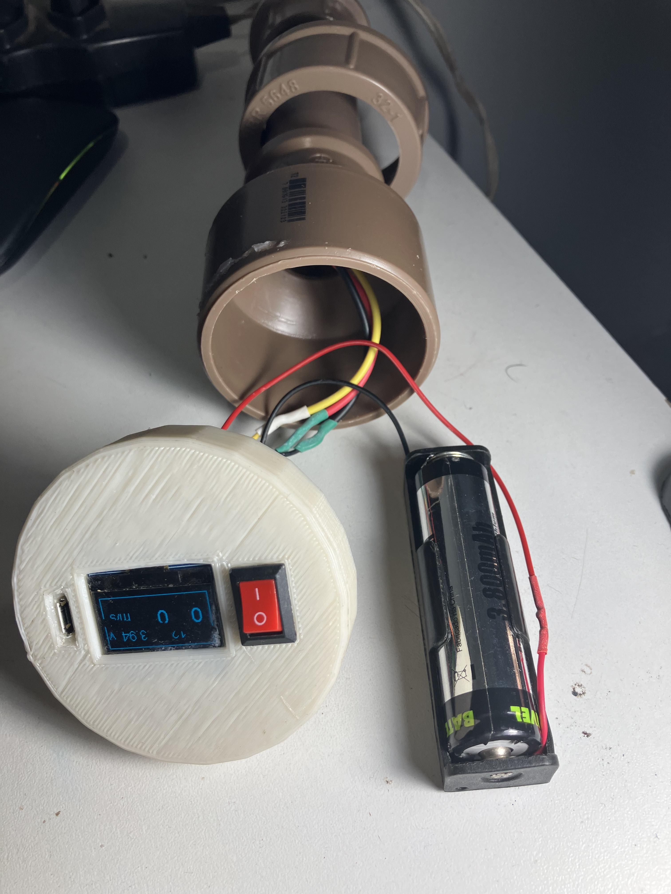
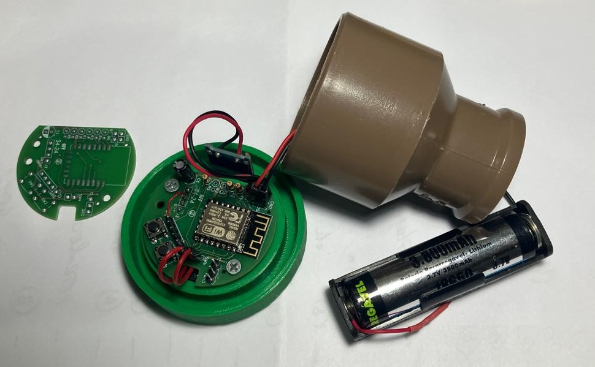
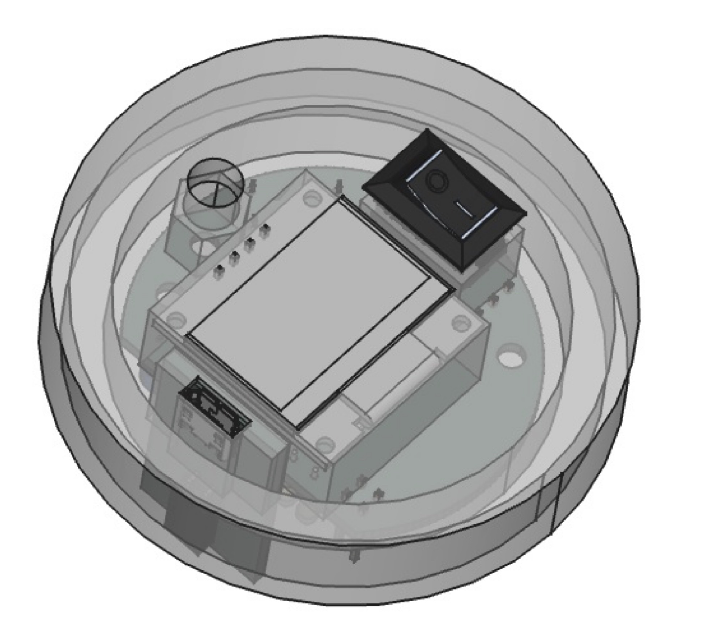
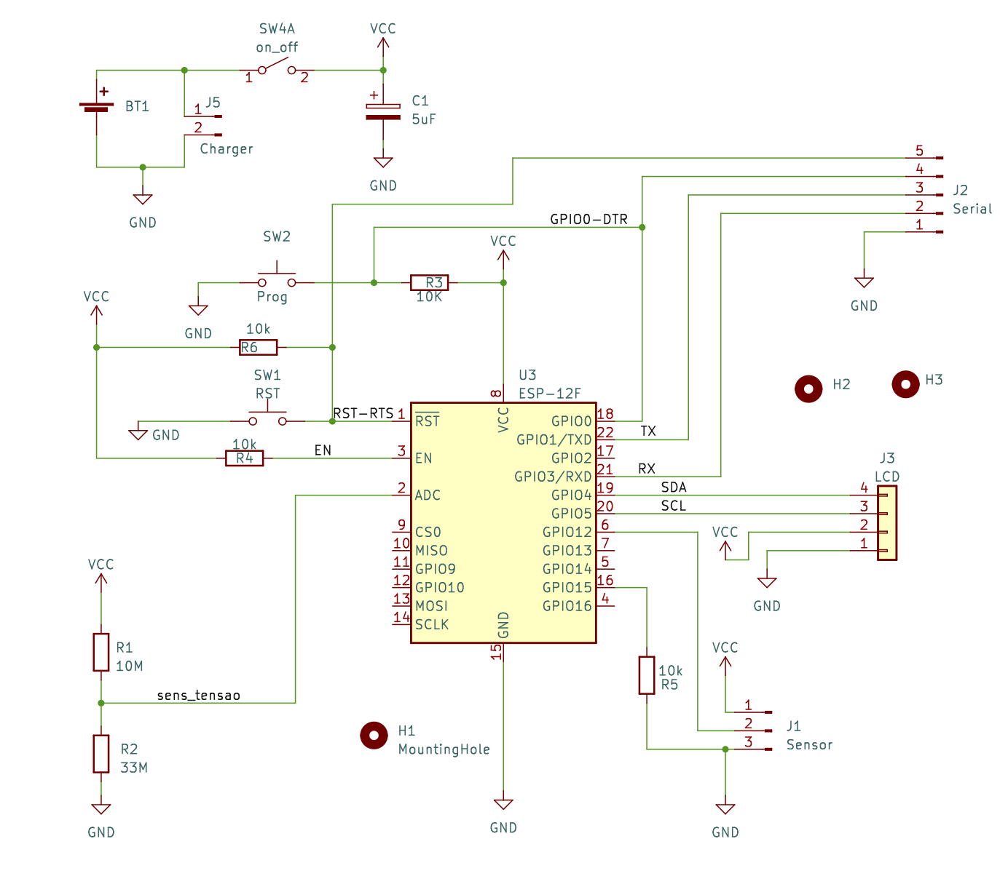
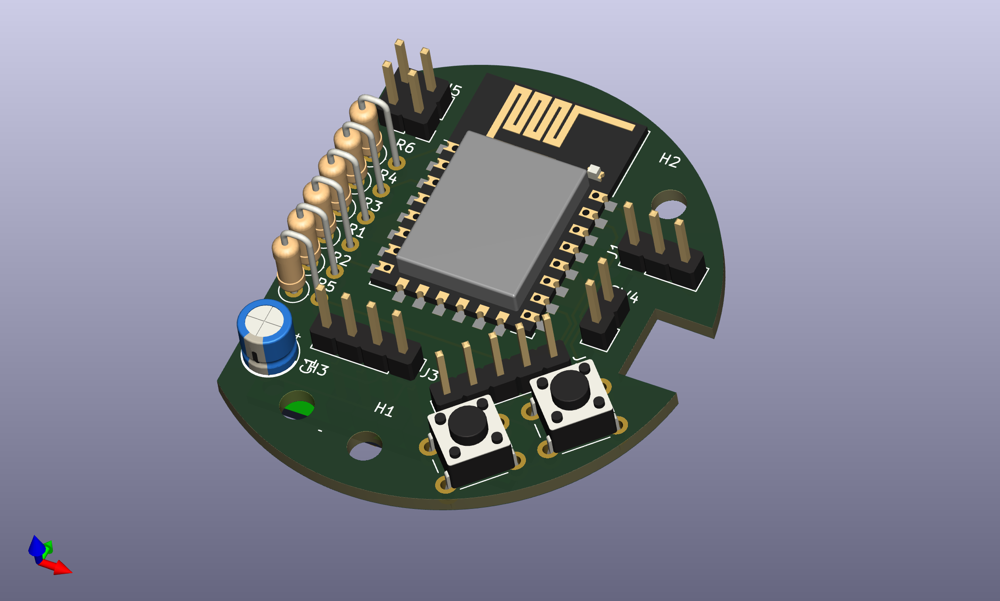
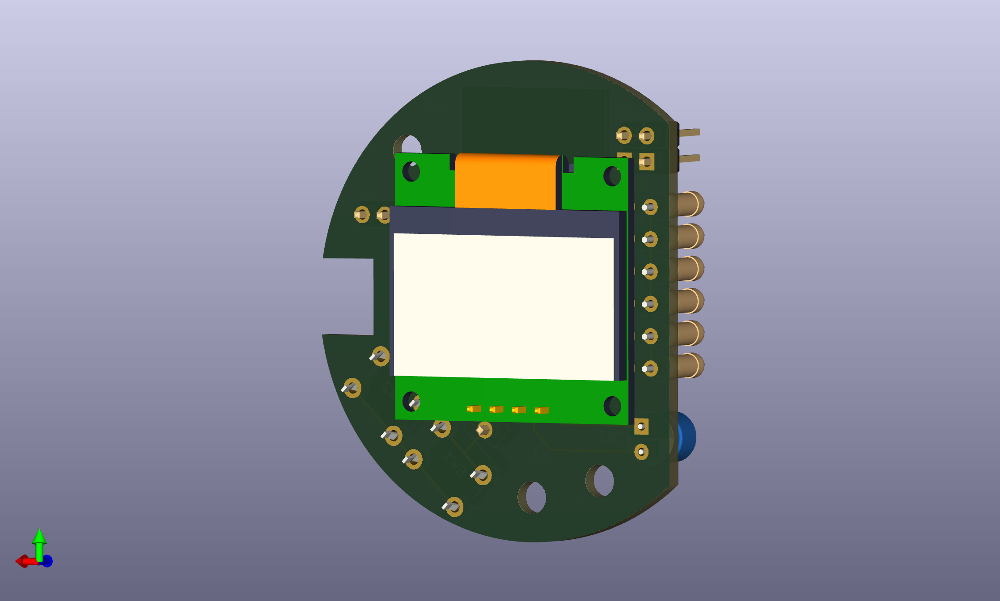
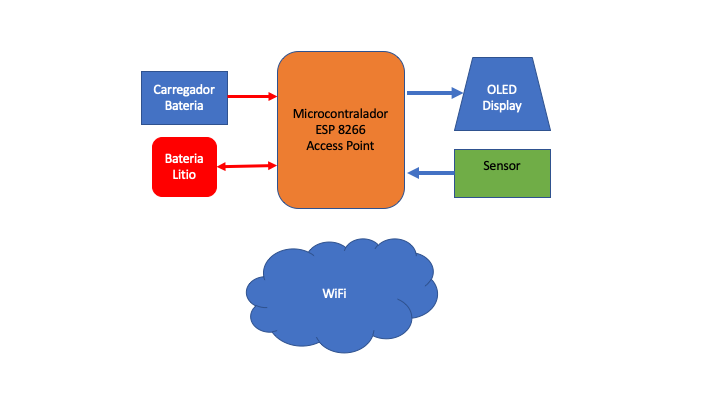

# Micro molinete para medir velocidade dos rios

# 1. Apresentação 
O micro molinete do Laboratório de Energia e Ambiente (LEA) foi desenvolvido para viabilizar os trabalhos de levantamento de campo para instalação de turbinas hidrocinéticas.

Neste repositório toda documentação desse produto está disponível e qualquer um pode baixar os desenhos técnicos, programas e fazer seu próprio produto.

O instrumento foi pensado para ser de fácil construção, com peças facilmente encontrável no mercado nacional, robusto o bastante para atender as exigências do trabalho de campo de levantamento, principalmente na região Amazônica.

A foto a seguir mostra o molinete desmontada e montada. Os componentes do micromolinte desmontados foram dimensionados para serem facil de  transportar numa muchila.  

 


# 2. O sensor

O elemento central do micro molinete é um sensor de vazão normalmente usado para medir vãzões em tubulações de duas polegadas, que foi adaptado para medir a velocidade da água num rio. A especificação do sensor de vazão é `Fluxímetro Fluxo Água Hall Sensor G 2 Pol 10-200l Dn 50` e este instrumento tem capacidade de medir vazões de 10 a 200 litros por minuto. 

O elemento de medição é uma hélice mostrada na figura a seguir onde ele foi adaptado para ser usado totalmente submergido na água montada em um haste de PVC de 32mm. Ao ser colocada para medir a velocidade da água o sensor gera um trem de pulsos elétricos proporcional à velocidade da água. 



Toda a estrutura do instrumento é montado com canos de PVC de 32mm ou 1 polegada e luvas, adaptadores e uniões em PVC.

Para utilizar este transdutor para medir a velocidade da água o equipamento foi calibrada no canal de água do Laboratório de Energia e Ambienta da Universidade de Brasília. A figura a seguir mostra a curva de calibração.



No eixo horizontal há o quantidade de pulsos por segundo e no eixo vertical a velocidade em metros por segundo. 


# 3. O indicador de velocidade

O  indicador de velocidade é composto por uma placa de aquisicão de dados com display e  bateria, montada num bucha redução soldável longa de 50 x 32 mm de PVC e uma tampa fabricada em ABS com uma impressora 3D.

A placa de controle e aquisição de dados é montada na tampa ABS junto com o display OLED, a chave liga-desliga e o carregador de bateria.
A bateria no seu respectivo suporte é alojado no tubo PVC colado na bucha.

A foto a seguir mostra tampa montada na bucha de PVC junto com a bateria de lítio.



Detalhe da placa de aquisição e sua montagem.


Desenho da tampe em perspectiva





## 3.1. Circuito de controle 

O circuito de controle tem como elemento central um microcontrolador ESP8266-07 com módulo WiFi sem fio e antena externa.
Além disso há uma [bateria de Ion de lítio 18650 ](https://www.huinfinito.com.br/baterias-acessorios/1419-bateria-litio-37v-18650-recarregavel.html)de 3,7V com capacidade de 3800 mAh recarregável e [módulo carregador de bateria lítio TP4056 - V2 com entrada MicroUSB-B.](https://www.huinfinito.com.br/modulos/1847-modulo-carregador-de-bateria-litio-tp4056-v2-microusb.html)

O módulo display [OLED 128x64 0.96"](https://www.huinfinito.com.br/telas-lcd-display/1383-modulo-display-oled-128x64-096-azul.html) e uma chave liga/desliga completa o hardware de controle.

O circuto de controle tem as seguintes funcionalidades:

* gravação manual do programa de controle por meio de setas e porta serial;
* gravação automática do programa de controle partir da porta serial;
* medição e mostrar a tensão da bateria
* carregador de bateria de litio com entrada micro USB-B
* Display OLED grafico 




## 3.2. Placa de circuito impresso

Os componentes eletrônicos sao montadas numa placa de circuito impresso especialmente desenvolvidos para este fim. A placa de circuiti impresso tem duas partes. A primeira parte aloja todos os componentes enquanto a segunda parte é para a montagem do display OLED gráfico de 128x64.
A figura a seguir mostra os componentes eletrônicos montados na placa de circuito impresso.



A Figura a seguir mostra a montagem do display OLED na placa de circuto impresso.




## 3.3. Software de controle


Programar o molinete pode se usar o procedimento colocado nese tutorial [https://circuitjournal.com/esp8266-with-arduino-ide ](https://circuitjournal.com/esp8266-with-arduino-ide)


Este programa simples lê o valor do sensor e a cada segundo mostra o valor correspondente em metros por segundo no display. O programa também dispibiliza o valor da velocidade na porta serial do microcontrolador.


``` 
/**
 *  * Software baseado do display o https://thingpulse.com
 *   
 * MicroMolinete com Sensor Medidor Fluxo Água 2 pol (Mercado Livre)
 * Hardware :
 *          ESP12F usando placa node MCU-10.0
 *          Display OLED baseado no SSD1306 SDA SCL
 *          Battery charger TP4056
 *          Bateria LPc 18650 @ 26800mAh 4.2V
 *            
 *
 */
 
#include <Wire.h>               // Only needed for Arduino 1.6.5 and earlier
#include "SSD1306Wire.h"        // legacy: #include "SSD1306.h"
#include "images.h"
#include "ESP8266TimerInterrupt.h"
#define SENS_ROT MISO

SSD1306Wire display(0x3c, SDA, SCL);   // ADDRESS, SDA, SCL  -  SDA and SCL usually populate automatically based on your board's pins_arduino.h

int contador;

void ICACHE_RAM_ATTR handleInterrupt() {
  contador++;
}

void setup() {
  Serial.begin(115200);
  Serial.println();
  Serial.println("Testando micromolinete 10/04/2022");
  display.init();
  display.flipScreenVertically();
  display.setFont(ArialMT_Plain_10);
  pinMode(SENS_ROT, INPUT_PULLUP); 
  attachInterrupt(digitalPinToInterrupt(SENS_ROT), handleInterrupt, FALLING);
}

float adc;
String adc_str;
int rpm;
String rpm_str;
float  velocidade;
String velocidade_str;
int segundos=0;
String segundos_str;

void loop() {
  adc= 0.004316 * analogRead(A0);
  adc_str=String(adc,2);  
  rpm=contador;
  contador=0;
  rpm_str=String(rpm);
  if (rpm >= 10)
  {
   velocidade=0.0659 * rpm-0.3523;
   velocidade_str=String(velocidade,1);
  }
  else velocidade_str="0";
  segundos++;
  segundos_str=String(segundos);
  Serial.print(velocidade);
  Serial.print("  ");  Serial.println(adc);
  display.clear();
  display.drawRect(0, 0, 128, 63);
  display.setFont(ArialMT_Plain_24);
  display.setTextAlignment(TEXT_ALIGN_LEFT);
  display.drawString(10, 22, rpm_str); // "Left aligned (0,10)");
  display.drawString(50, 22, velocidade_str); // "Left aligned (0,10)");  
  display.setFont(ArialMT_Plain_16);
  display.setTextAlignment(TEXT_ALIGN_RIGHT);
  display.drawString(50, 6, segundos_str); // "Left aligned (0,10)");
  display.drawString(110,6, adc_str); // "Left aligned (0,10)");
  display.drawString(126,6, "v"); // "Left aligned (0,10)");
  display.drawString(120,28, "  m/s"); // "Left aligned (0,10)"); 
  display.display();
  delay(1000);
} 

```


# 4. Operação 

Optou-se em desenvolver um hardware baseado numa arquitetura computacional com microcontrolador e controlador Wireless (WiFi) que permitiria o equipamento ser usado como instrumento independente ou junto com o celular de uso comum para armazenamento de dados, assim como parte de um sensor de monitoramento de uma rede de monitoramento ou sistema Scada.

O diagrama de blocos do Molinte mostra a estrutura básica do instrumento com os diversos componentes funcionais. 


## 4.1. Operação independente

A operação independente é a configuração mais simples onde o valor medido da velocidade da água é mostrado no display de forma instantánea. Neste caso o controlador WiFi do molinete não é usado.

## 4.2. Operação como ponto de acesso para celular 

Quando há necessidade de monitorar os dados de forma indireto a partir de um outro dispositivo com mais capacidade de mostrar os dados, pode-se optar para funcionar o molinete como ponto de acesso para rede wireless. 
Nesse modo mantém se a mesma funcionalidade do modo de operação independente, acressido da funcionalidade do Access Point (AP) do controlador WiFi.
Neste caso qualquer dispositivo com interface WiFi pode accessar o molinete e visualizar os dados que ela está medindo.
Este acesso pode ser feito por exemplo pelo celular ou um computador, desde que tenha os dados da rede e senha do ponto de acesso do molinete.
Ao ter acesso do AP do molinete os dados podem ser obtidos por meio do protocolo HTML simples, de forma que não se precisa de programa específico no computador ou celular para ler os dados. 

## 4.3. Operaçao como ponto de medição numa rede WiFi

Quando há necessidade de ligar o molinete a uma rede existente de WiFi e assim interligar-o a um computador remoto, pode-se optar em configurar o controlador WiFi no modo Station (STA) 
O modo STA torna o molinte num cliente de uma rede wireless existente e dessa forma ter acesso a internet como se fosse um computador ou smartphone. 
A transmissão de dados pode ser realizado por meio de um protocolo mais elaborado como por exemplo Modbus-IP ou MQTT. 

